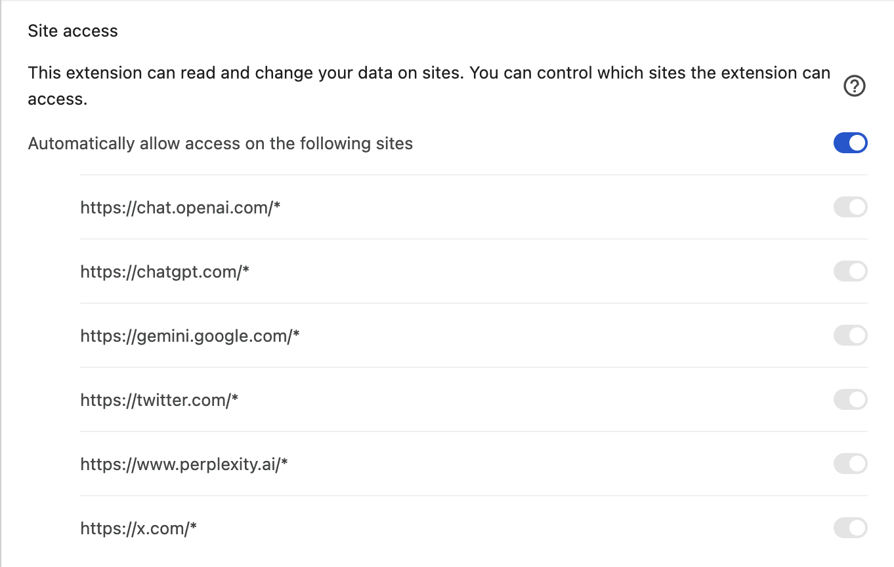
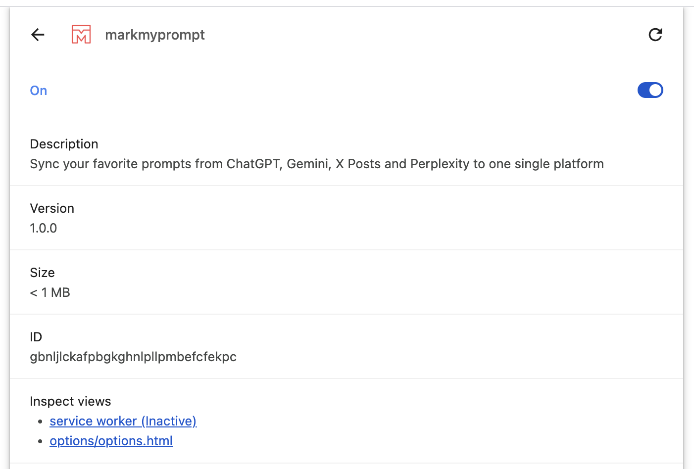
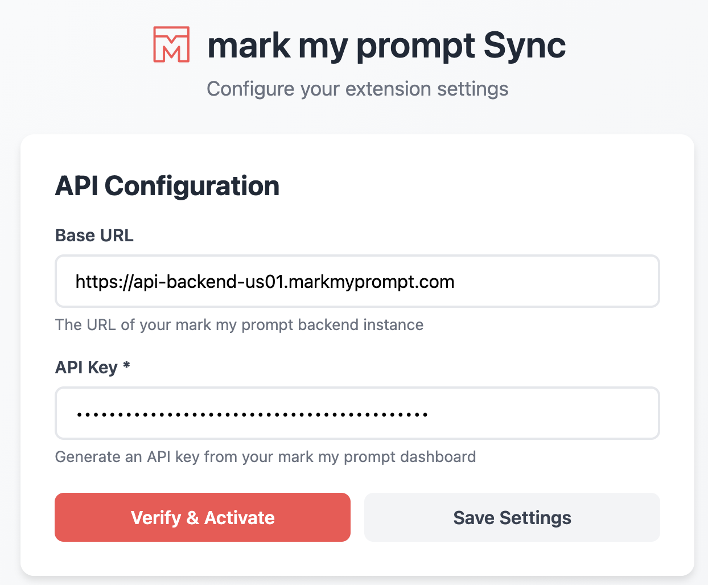
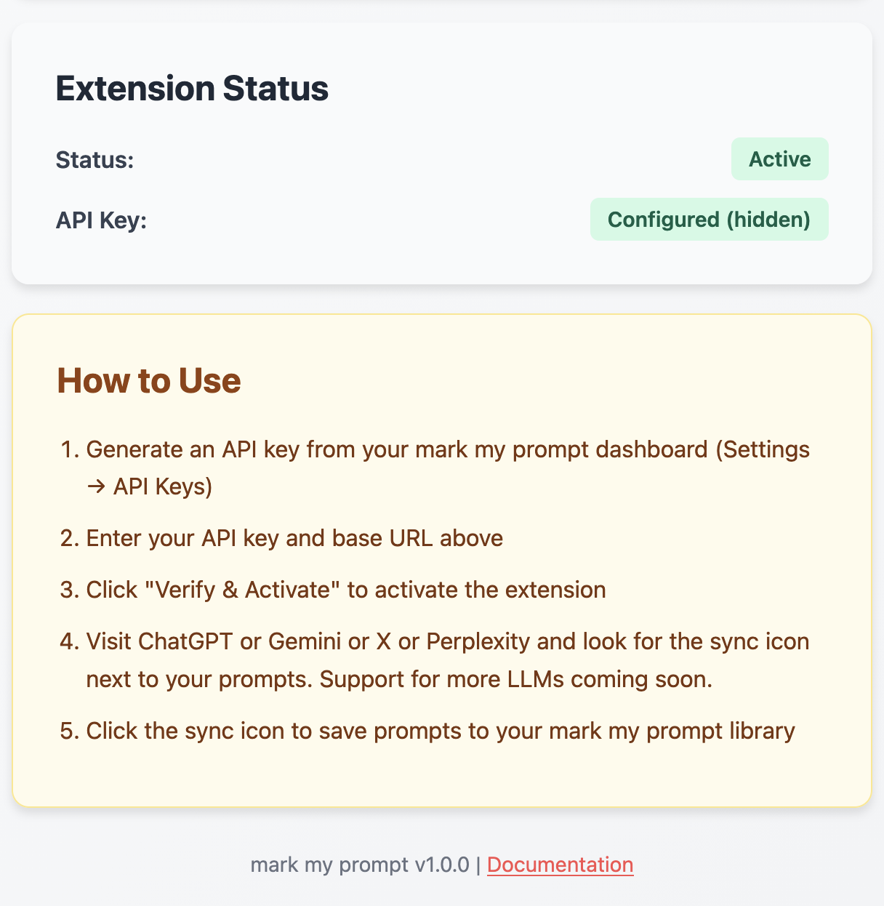
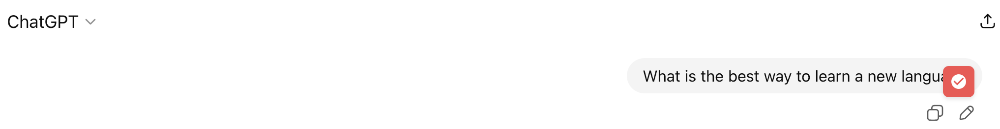
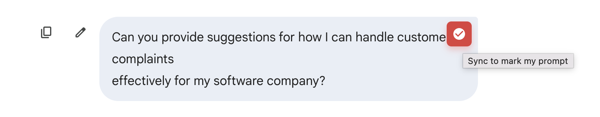
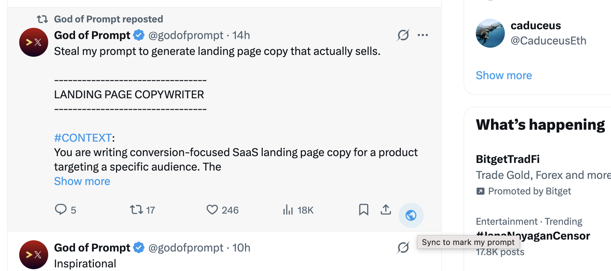
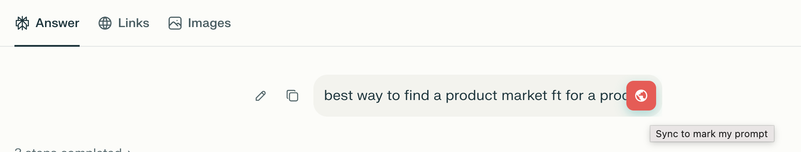

# mark my prompt - Chrome Extension

A Chrome extension that allows you to sync prompts from ChatGPT, Gemini, X (Twitter), X Grok conversations, and Perplexity directly to your mark my prompt library.



## Features

- ✅ **One-Click Sync**: Floating sync button appears next to each user prompt
- ✅ **Multi-Platform Support**: Works on ChatGPT, Gemini, X (Twitter), X Grok conversations, and Perplexity
- ✅ **API Key Authentication**: Secure authentication using mark my prompt API keys
- ✅ **Auto-Tagging**: Automatically tags prompts with source platform (chatgpt/gemini/twitter/grok/perplexity)
- ✅ **Visual Feedback**: Toast notifications for sync status
- ✅ **Configurable**: Set custom API base URL for self-hosted instances
- ✅ **Manual Tweet Selection**: Choose which tweets to sync to your prompt library
- ✅ **Image Text Extraction**: Automatically extracts prompts from images in X posts using AI
- ✅ **Conversation Support**: Sync prompts from X Grok AI conversations and Perplexity searches

## Installation

### Step 1: Load the Extension in Chrome

1. **Open Chrome** and navigate to `chrome://extensions/`
2. **Enable Developer Mode** by toggling the switch in the top-right corner
3. Click **"Load unpacked"** button
4. Navigate to the `markmyprompt-chrome-extension` folder
5. Select the folder and click **"Select Folder"** (or **"Open"** on Mac)
6. The extension should now appear in your extensions list

> **Note**: For development, you'll need to keep Developer Mode enabled. The extension will remain loaded until you remove it or disable Developer Mode.

### Step 2: Grant Permissions

When you first load the extension, Chrome will ask for permissions to access certain websites. Click **"Allow"** to grant the necessary permissions.



The extension needs access to:

- `chat.openai.com` and `chatgpt.com` - For ChatGPT integration
- `gemini.google.com` - For Gemini integration
- `x.com` and `twitter.com` - For X/Twitter integration
- `www.perplexity.ai` - For Perplexity integration

### Step 3: Generate API Key

Before you can use the extension, you need to generate an API key from your mark my prompt account:

1. Open your **mark my prompt** web app
2. Navigate to **Settings → API Keys**
3. Click **"Generate New API Key"** or **"+ New API Key"**
4. Give it a name (e.g., "Chrome Extension")
5. **Copy the API key immediately** (you won't be able to see it again!)

## Activation

### Step 1: Open Extension Settings

1. Click the **mark my prompt** extension icon in the Chrome toolbar
2. Click **"Open Settings"** button in the popup

   Alternatively, you can:

   - Right-click the extension icon → **"Options"**
   - Or go to `chrome://extensions/` → find "markmyprompt" → click **"Options"** or **"Details"** → **"Extension options"**

### Step 2: Enter API Key

1. In the settings page, you'll see the **API Configuration** section
2. Enter your **API Key** in the "API Key \*" field
3. (Optional) Modify the **Base URL** if you're using a self-hosted instance
   - Default: `https://api-backend-us01.markmyprompt.com`



### Step 3: Verify and Activate

1. Click the **"Verify & Activate"** button
2. Wait for the verification process to complete
3. You should see a success message: **"✓ API key verified! Extension is now active."**



The extension status will change to **"Active"** (green badge) once verification is successful.

> **Note**: If verification fails, check that:
>
> - Your API key is correct and hasn't been revoked
> - The Base URL is correct and accessible
> - Your internet connection is working

## Usage

Once activated, the extension will automatically inject sync buttons on supported platforms. Here's how to use it on each platform:

### On ChatGPT (chat.openai.com / chatgpt.com)

1. Open **ChatGPT** and start or continue a conversation
2. **Hover over** any of your prompts (user messages)
3. A **purple sync button** will appear in the top-right corner of the message
4. **Click the button** to sync that prompt to mark my prompt
5. A success notification will appear: **"✓ Prompt synced successfully!"**



The sync button states:

- **Purple gradient**: Ready to sync
- **Gray with spinner**: Syncing in progress
- **Green with checkmark**: Successfully synced
- **Red with X**: Sync failed

### On Gemini (gemini.google.com)

1. Open **Gemini** and start or continue a conversation
2. **Hover over** any of your prompts (user queries)
3. A **purple sync button** will appear in the top-right corner
4. **Click the button** to sync that prompt to mark my prompt
5. A success notification will appear: **"✓ Prompt synced successfully!"**



### On X (Twitter) (x.com / twitter.com)

1. Browse **X (Twitter)** and find tweets containing interesting prompts
2. Look for the **sync button** in the tweet's action bar (next to like, retweet, share buttons)
3. **Click the sync button** to save that tweet's content as a prompt

**For text tweets:**

- The tweet text will be synced directly to your mark my prompt library

**For image tweets:**

- The extension will automatically extract text from images using AI
- The extracted prompt will be synced with an `image-extracted` tag



Success notifications:

- **"✓ Prompt synced successfully!"** - For text tweets
- **"✓ Image prompt extracted and synced!"** - For image tweets

### On Perplexity (www.perplexity.ai)

1. Open **Perplexity** and start a search or conversation
2. **Hover over** your search queries (user prompts)
3. A **teal sync button** will appear in the top-right corner
4. **Click the button** to sync that search query to mark my prompt
5. A success notification will appear: **"✓ Prompt synced successfully!"**



The prompt will be saved with the `perplexity` tag for easy filtering.

### On X Grok Conversations (x.com/i/grok)

1. Open or continue a conversation with **Grok AI**
2. **Hover over** your messages (user prompts)
3. A **purple sync button** will appear in the top-right corner
4. **Click the button** to sync that specific prompt to mark my prompt
5. The prompt will be saved with the `grok` tag for easy filtering

## Features in Detail

### Automatic Source Tagging

Every synced prompt is automatically tagged with its source:

- ChatGPT prompts → tagged with `chatgpt`
- Gemini prompts → tagged with `gemini`
- X (Twitter) text prompts → tagged with `twitter`
- X (Twitter) image prompts → tagged with `twitter` and `image-extracted`
- X Grok conversation prompts → tagged with `grok`
- Perplexity search queries → tagged with `perplexity`

This makes it easy to filter and organize prompts by platform and extraction method in your mark my prompt library.

### Duplicate Prevention

The extension tracks synced prompts during your session to prevent accidental duplicates. If you try to sync the same prompt again, you'll see: **"This prompt is already synced!"**

### Image Text Extraction

The extension can automatically extract prompts from images in X posts:

**How it works:**

1. When you click sync on a tweet with images (and little/no text)
2. The extension downloads the image and converts it to base64
3. Sends the image to mark my prompt's backend API
4. Uses Google Gemini Vision AI to extract text from the image
5. Saves the extracted text as a prompt with `image-extracted` tag

**Supported scenarios:**

- Screenshots of prompts from other AI tools
- Images containing written instructions or queries
- Technical diagrams with text annotations
- Any image with readable text content

**Requirements:**

- Backend must have `GEMINI_API_KEY` configured
- Images must contain clear, readable text
- Supported formats: PNG, JPEG, GIF, WebP

### Visual States

The sync button changes appearance based on state:

- **Purple gradient**: Ready to sync
- **Gray with spinner**: Syncing in progress (text or image extraction)
- **Green with checkmark**: Successfully synced
- **Red with X**: Sync failed

## Troubleshooting

### Extension Not Working

1. **Check Status**: Click extension icon → verify status is "Active"
2. **Verify API Key**: Go to Settings → click "Verify & Activate"
3. **Check Console**: Open DevTools (F12) → Console tab → look for errors
4. **Reload Extension**: Go to `chrome://extensions/` → find the extension → click reload button

### Sync Buttons Not Appearing

1. **Refresh the Page**: The extension injects buttons after page load
2. **Check Platform**: Make sure you're on a supported site (ChatGPT, Gemini, X, Perplexity)
3. **Wait a Moment**: Content scripts scan periodically (every 2-3 seconds)
4. **Check Extension Status**: Ensure the extension is "Active" in settings
5. **Inspect Elements**: Right-click prompt → Inspect → check for `.promptean-sync-btn`

### API Errors

**"API key not configured"**

- Go to Settings and enter your API key

**"Extension is not activated"**

- Click "Verify & Activate" in Settings

**"Verification failed"**

- Check that mark my prompt backend is running
- Verify Base URL is correct
- Ensure API key is valid and not revoked
- Check your internet connection

**"Failed to sync"**

- Check browser console for detailed error (F12 → Console)
- Verify backend is accessible
- Check API key hasn't expired
- Ensure you're connected to the internet

### CORS Issues

If you're using a self-hosted mark my prompt instance, make sure CORS is properly configured to allow requests from browser extensions:

```python
# In backend CORS config
CORS_ORIGINS = ['chrome-extension://*']
```

## Architecture

The extension is built with a modular architecture for easy maintenance and extensibility:

```
markmyprompt-chrome-extension/
├── manifest.json           # Extension configuration
├── background.js           # Service worker for API communication
├── content/
│   ├── utils.js           # Shared utilities (platform-agnostic)
│   ├── chatgpt.js         # ChatGPT-specific integration
│   ├── gemini.js          # Gemini-specific integration
│   ├── twitter.js          # Twitter/X-specific integration
│   ├── grok.js             # Grok conversation integration
│   ├── perplexity.js       # Perplexity integration
│   └── styles.css         # Shared UI styles
├── options/
│   ├── options.html       # Settings page
│   ├── options.css        # Settings styles
│   └── options.js         # Settings logic
├── popup/
│   ├── popup.html         # Extension popup
│   └── popup.js           # Popup logic
├── icons/
│   └── (icon files)       # Extension icons
└── img/
    └── (screenshots)      # Documentation screenshots
```

### Key Components

- **Background Service Worker** (`background.js`): Handles API communication, key verification, and prompt syncing
- **Content Scripts** (`chatgpt.js`, `gemini.js`, etc.): Inject sync buttons into web pages
- **Utilities** (`utils.js`): Shared code for button creation, toast notifications, and sync logic
- **Options Page**: User-friendly settings interface

## Chrome-Specific Notes

This Chrome extension is built using Chrome's Manifest V3:

- Uses `chrome.storage.sync` API for settings persistence
- Background script runs as a service worker
- Uses Chrome's content script injection system
- Compatible with Chrome's extension management APIs

## Adding New Platforms

To add support for a new AI chat platform:

1. **Create a new content script** (e.g., `content/claude.js`)
2. **Copy the structure** from `chatgpt.js` or `gemini.js`
3. **Update selectors** to match the new platform's DOM
4. **Add to manifest.json**:

```json
{
  "matches": ["https://claude.ai/*"],
  "js": ["content/utils.js", "content/claude.js"],
  "css": ["content/styles.css"]
}
```

5. **Add host permission** in manifest.json:

```json
"host_permissions": [
  "https://claude.ai/*"
]
```

The `PrompteanUtils` class handles all the heavy lifting, so you only need to:

- Identify user message selectors
- Extract prompt text
- Call `utils.syncPrompt()`

## Development

### Project Structure

```
markmyprompt-chrome-extension/
├── manifest.json      → Extension metadata and permissions
├── background.js      → Background service worker
├── content/          → Content scripts (run on web pages)
├── options/          → Settings page
├── popup/            → Extension popup
├── icons/            → Extension icons
└── img/              → Documentation screenshots
```

### Testing Locally

1. Make changes to code
2. Go to `chrome://extensions/`
3. Click **reload button** for mark my prompt extension
4. Refresh the ChatGPT/Gemini/Perplexity page
5. Test your changes

### Debugging

- **Background Service Worker**: `chrome://extensions/` → mark my prompt → "service worker" link (or "Inspect views: service worker")
- **Content Scripts**: Open DevTools on the target page (F12)
- **Options Page**: Right-click Options → Inspect, or go to `chrome://extensions/` → "Options" link
- **Popup**: Right-click extension icon → Inspect popup

## Security

- API keys are stored securely using Chrome's `chrome.storage.sync` API
- Keys are never logged or exposed in console
- API communication uses HTTPS (when not localhost)
- No data is collected or transmitted except to your mark my prompt instance

## Permissions Explained

- `storage`: Store API key and settings
- `activeTab`: Interact with current tab to inject sync buttons
- `host_permissions`: Access ChatGPT, Gemini, X, and Perplexity to inject content scripts

## Limitations

- Only syncs **user input prompts** (not AI responses)
- Requires **active internet connection** to mark my prompt backend
- Synced prompts are **private by default** (change in mark my prompt web app)
- Duplicate detection is **session-based** (resets on page reload)
- Extension must be reloaded after code changes during development

## Future Enhancements

- [ ] Bulk sync all prompts in a conversation
- [ ] Sync entire conversations (with AI responses)
- [ ] Add more AI platforms (Claude, etc.)
- [ ] Offline queue for sync operations
- [ ] Custom tag selection before syncing
- [ ] Keyboard shortcuts
- [ ] Sync statistics dashboard
- [ ] Chrome Web Store publication

## License

This extension is part of the mark my prompt project.

## Support

For issues, questions, or feature requests, please refer to the main mark my prompt documentation or open an issue in the repository.

---

**mark my prompt**
